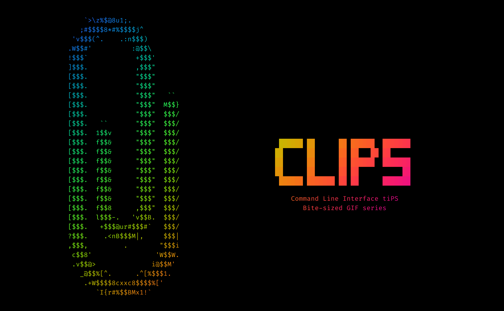

# 📎 CLIPS :: CLI tiPS


## About

<p>🌇 CLIPS is a series of GIF-casts with various CLI tips.</p>
<p>🧰 At the same time it's a collection of tools/links and a few bash scrips helping me to create those GIF-casts.</p>

## Usage

````shell
source ./start ./scenarios/s0e0.txt ./episodes/s0e0/s0e0_
next               # echoes the first line of the scenario
n                  # OR using alias
n s 1 1            # OR rewinding to a certain scene/line
n s 1 1 && n s 2 5 # OR playing a few scenes in one go
````

**Here's the list of all the possible `next` args**:

| next argument            | possible parameters           | CLIPS feature                                                                            |
| :----------------------: | ----------------------------- | ---------------------------------------------------------------------------------------- |
|                          |                               | no argument; prints the next line as a usual echo                                        |
|            _             |                               | prints the next line with typing effect                                                  |
|            a             |                               | prints the next line as an annotation (echo till the "✂︎" separator, typing effect after) |
|            b             |                               | prints the next line as Bear's cue                                                       |
|            c             | any parameter                 | prints the next line as a command (executes it if no argument passed)                    |
|            d             | `ey~es` `fa~ce`               | prints the next line as Dude's cue                                                       |
|            e             |                               | executes the next line as an expect one-liner                                            |
|            p             | `command`                     | passes the next line to a specified command using pipe                                   |
|            s             | `scene #` `line #`            | executes the next "scene" script (with args passed: forces scene and scenario line #)    |
|            t             |                               | prints the next line as a title (using `toilet`)                                         |

**Here are some tips on scenarios creation**:

* There's no need to create any scenes (and passing the prefix) if you're not planning on using multi-line outputs (like annotations) or custom delays/clears
* Titles (`t`) have `pagga` font and piped to `lolcat` by default, for any customisations see `p` parameter
* The Dude (`d`) has a few tricks up his sleeve:
  - The line is automatically trimmed, to preserve any trimmable chars use escaping with `\`
  - The Dude has customisable face features, pass first argument with underscore separator to set eyes and the second to set the mouth and the nose:
    - `n d "ಠ~ಠ" " ~ʖ"`
    - `n d "x~x" " ~ʖ"`
    - `n d "ʘ~ʘ" "｡~ʖ"`
    - `n d "●~●" "_~ʖ"`
    - `n d "°~°" "⎵~⌡"`
    - `n d "⚙~ಠ" "⏠~ʖ"`
* The Bear is just a bear, nothing special here
* Command (`c`) could be either typed and executed or just typed: `n c _`
  - Using a special separator char `✂︎` it's possible to make pre-/post-hook commands to be executed before the original command
  - If the command has no "hooks" it's gonna be printed/executed as usual
  - Instead of aliases in "hooks" it's better to use functions, because of non-interactive shell alias expansion issues (see: https://bit.ly/3ans9w5)
* Annotations (`a`) make sense only in scenes or `n a && n a && n a` execution sequences, since they take multiple lines
* Annotations (`a`) have a special separator `✂︎` which divides the lines and the annotation printing. The former is faster and the latter is with the typing effect
* Typing effect is a simple `pv` command, the parameter `_` for typing effect output means to represent a typing cursor
* Scenes (`s`) functionality is an abstraction on top of `next` command, which for GIF-cast purposes allows to:
  - hide actual commands behind the CLIPS
  - automate the series of commands
  - avoid having prompt in between separate commands
  - have multiple scenes to manually show something in between and go to the next one
  - rewind to sub-sections of the CLIPS
* Scenes optionally accept two args `scene number` and `line number` to force the current scene and rewind the scenario to the appropriate line
  - If you have identical scenes for different starting lines, there's no need to duplicate them, just call the same scene with an appropriate line number
* Pipes `p` allow to delegate line output to any command(s) to extend CLIPS possibilities without overcomplicating the script (escape hatch):
  - `n p cowsay -f udder | lolcat` (see `/usr/local/share/cows`)
  - `n p cowthink -f elephant`


## [Episodes](./EPISODES.md)

## CLIPS Tech Specs && Tips

* `tput cols && tput lines` = `125 × 32`
* `1080x620`
* `xterm-256color`
* `Ctrl+v u2702` (https://unicode-table.com/en/2702/)

## Resources and Deps

* `brew install coreutils`
* https://robotmoon.com/256-colors/ - useful colour reference
* https://en.wikipedia.org/wiki/Box-drawing_character
* https://github.com/cacalabs/toilet
* http://ivarch.com/programs/pv.shtml
* https://github.com/busyloop/lolcat
* https://github.com/mvdan/sh
* https://github.com/koalaman/shellcheck
* https://www.csie.ntu.edu.tw/~r92094/c++/VT100.html
* https://www.shortquts.com/wp-content/uploads/2019/10/TclTk_quickref.pdf
* https://gist.github.com/smileart/6cf5de61d5f393d26fa0
